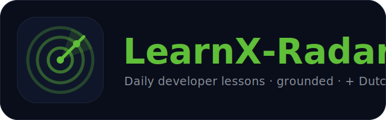
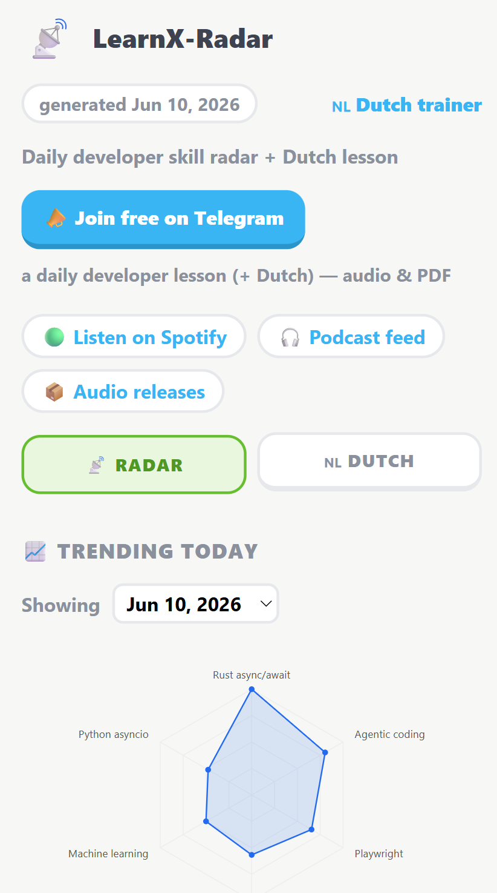
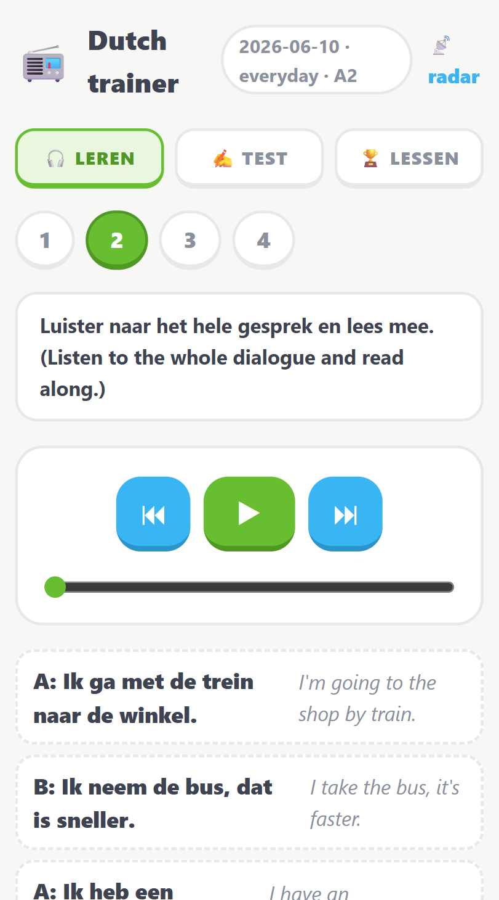

<p align="center">
  
</p>

# LearnX-Radar

> **A self-updating curriculum engine: it watches real developer signals for emerging skill gaps and ships you a grounded audio lesson every day — on zero backend.**

[](https://github.com/Yusuprozimemet/LearnX-Radar/actions/workflows/ci.yml)
[](https://yusuprozimemet.github.io/LearnX-Radar/)
[](https://open.spotify.com/show/033tPjkKDj5xF09FQC0Di7)
[](https://t.me/learnradar)


Every morning a GitHub Actions cron scrapes **seven public sources** (GitHub
Trending, HN hiring + front page, Stack Overflow, dev.to, Reddit, Lobste.rs),
scores skill gaps by **demand × novelty × momentum**, writes a teaching brief
**grounded in the actual source text** with real citations, and delivers it as a
podcast-style MP3 — to Telegram, email, Spotify, and a live dashboard.

```
scrape (7 sources) -> extract skills -> score gaps -> grounded brief
   -> curriculum -> dialogue -> audio -> deliver -> dashboard + podcast feed
```

There is no server anywhere: committed JSON is the database — personal state
lives in a separate **private** repo so nothing personal sits in this public one
— GitHub Releases is the audio CDN, GitHub Pages is the frontend, and feedback
comes back through Telegram deep links. Full detail in [Architecture](#architecture) below.

<table align="center">
  <tr>
    <td align="center"><a href="https://yusuprozimemet.github.io/LearnX-Radar/"><b>Live skill radar</b></a></td>
    <td align="center"><a href="https://yusuprozimemet.github.io/LearnX-Radar/dutch.html"><b>Dutch trainer</b></a></td>
  </tr>
  <tr>
    <td></td>
    <td></td>
  </tr>
</table>

## Subscribe (free)

- **Telegram — [t.me/learnradar](https://t.me/learnradar):** every daily lesson
  as audio plus the full lesson as a PDF. Joining is the whole subscription —
  Telegram holds the member list, so no personal data is stored on my side.
- **Spotify — [listen here](https://open.spotify.com/show/033tPjkKDj5xF09FQC0Di7):**
  the lessons as a daily podcast, or add the
  [feed URL](https://yusuprozimemet.github.io/LearnX-Radar/podcast.xml) to any
  podcast app.
- **Waitlist for *personalized* lessons — [tally.so/r/WOqPdP](https://tally.so/r/WOqPdP):**
  early access to lessons matched to your stack & goals (individuals & teams).

## Why it's built this way

The interesting part isn't that an LLM writes lessons — it's where the LLM is
**not** trusted:

- **Deterministic where it must be exact.** Per-source skill attribution is a
  corpus scan, not an LLM tally; the brief's `## Sources` list is authored in
  code (the LLM never writes URLs); the Dutch cloze exercise is generated
  without any LLM, so nothing can be wrong.
- **Numbers chosen by experiment.** Extraction chunk size and the grounding
  read budget were swept against the real corpus with committed harnesses in
  [scripts/](scripts/) — none of the constants are guesses.
- **Feedback measured, both tracks.** The dashboard tracks a measured 30-day
  recall rate for Dutch words and a 1–5 owner rating per developer lesson —
  both reported through one-tap Telegram deep links (`/start` messages from
  your own account: no webhook, no token in the browser).
- **Privacy as architecture.** PII is redacted at ingestion — before dedup,
  before the LLM, before anything is persisted or delivered. The channel and
  waitlist store no subscriber data in this repo.
- **Graceful degradation.** Every optional secret degrades cleanly, the Dutch
  branch is guarded so the dev lesson always ships, the LLM falls back from a
  slow NVIDIA to Groq mid-run (a circuit breaker writes off a stalling primary so
  the cron can't time out waiting on it), and stage failures are DM'd to the
  owner instead of hiding in Actions logs. Each run also records its per-stage
  health, source counts, and LLM-fallback frequency to a rolling `run_history.json`,
  surfaced on the dashboard's **Status** tab — so a same-day DM becomes a visible
  track record (verdicts only, no error text, so it's safe on the public page).

## The Dutch track

The same engine runs a second daily lesson: a **Dutch coach** (A2 → inburgering
B1) built on the **Delftse methode** (listen → imitate → produce) — audio with
repeat pauses, an [interactive trainer page](https://yusuprozimemet.github.io/LearnX-Radar/dutch.html)
with checked exercises, and spaced repetition driven by **measured recall**:
what you can produce, not just what you were sent. Vocabulary is anchored to a
frozen, human-reviewed word bank — the LLM writes sentences *around* fixed
words and can never invent vocabulary.

See the [Dutch coach](#dutch-coach) section below for the full design.

## Quick start

```
pip install -r requirements.txt
# copy .env.example to .env and fill in values
python main.py            # one full daily run
python -m dashboard       # rebuild the static dashboard from committed state
pytest && ruff check .    # tests + lint (same as CI)
```

Required env vars: `NVIDIA_API_KEY`, `TELEGRAM_BOT_TOKEN`, `TELEGRAM_CHAT_ID`,
`GMAIL_APP_PASSWORD`, `EMAIL_FROM`, `EMAIL_TO`. Everything else is optional and
degrades gracefully — see [Configuration](#configuration).

**No-secret run (Docker).** The dashboard rebuilds from committed JSON state
alone — no API keys, no network — exactly as the Pages deploy does. From a clean
clone:

```
docker build -t learnx-radar .
docker run --rm -v "$PWD/dashboard:/app/dashboard" learnx-radar
```

This writes `dashboard/index.html` + `podcast.xml`. It's also the "deploy": a
GitHub Actions cron runs `python main.py` daily and a Pages workflow rebuilds the
dashboard from state after each run — see [Workflows](#workflows).

---

# Architecture

The deep dive: how the daily run works, why the numbers are what they are,
every config flag, every state file.

## Pipeline (the daily run)

```
ingest feedback (lesson star ratings + Dutch recall reports, via getUpdates)
  -> scrape (7 sources) -> redact PII -> dedup
  -> extract skills (map-reduce + deterministic attribution)
  -> score gaps (demand x novelty x momentum) -> select today's topic
  -> write grounded brief (Jina + Exa, cited) -> plan curriculum
  -> generate dialogue -> build audio (edge-tts)
  -> build Dutch lesson (vocab + sentences + Delft audio + trainer JSON, archived)
  -> render PDFs -> deliver (Telegram DM + channel, email)
  -> persist state -> refresh dashboard + podcast feed
```

On its configured weekday the run also posts the personalization-waitlist CTA to
the channel and cross-posts the lesson to dev.to as a draft.

Each stage is wrapped so one failure produces a clear message instead of a silent
half-run; failures are collected and DM'd to the owner at the end
(`RUN_REPORT_ENABLED`). The Dutch branch is independent and fully guarded: any
failure there is logged and skipped so the developer lesson always ships.

## Accuracy & grounding

Each accuracy feature sits behind its own config flag for clean rollback:

- **Open-vocabulary discovery (7 sources).** Reddit, the HN front page, and
  Lobste.rs are open-vocabulary feeds, so the radar can surface skills it was
  never pre-configured to watch — not just a fixed tag/language list. Per-source
  weights (`SOURCE_WEIGHTS`) keep real demand (HN Hiring, Stack Overflow) above
  community buzz.
- **Map-reduce extraction + deterministic attribution** (`EXTRACTION_MAPREDUCE`).
  The corpus is chunked and skills extracted per chunk (recall), variants merged
  (`SKILL_ALIASES`), then each skill's source set is computed by **scanning the
  corpus** rather than trusting the LLM to tally — so the demand weight is exact.
  Chunk size was chosen by experiment ([scripts/exp_extraction.py](scripts/exp_extraction.py)).
- **Grounded briefs** (`GROUNDING_ENABLED`). Instead of writing from the skill
  name alone, the brief reads the actual sources that surfaced the skill
  (keyless Jina reader) plus fresh Exa web results, and cites a real
  `## Sources` list authored in code — the LLM never writes URLs. Read budget
  chosen by experiment ([scripts/exp_grounding.py](scripts/exp_grounding.py)).
  The grounding helpers in [radar/research/](radar/research/) are vendored from
  the sibling LearnX-Search. Grounding biases toward **recent discourse** over
  evergreen "what is X" explainers (`GROUNDING_RECENCY_DAYS` + a stable re-rank
  that sinks explainer URLs and floats discussion sources), and the brief carries
  a `## What's being discussed` section so the lesson names the real tools,
  techniques, and debates — not just the abstract concept.
- **Cross-day momentum** (`MOMENTUM_ENABLED`). Scoring looks back over
  `trending_history` (matched by canonical name) and boosts skills sustained and
  accelerating across days, while damping one-day spikes — orthogonal to the
  spaced-repetition novelty signal. The window was tuned to 10 days by experiment
  ([scripts/exp_momentum.py](scripts/exp_momentum.py)) once enough history accrued.
- **Autonomous skill-alias curation.** One rising skill can appear under several
  names (`AI agents` / `Autonomous AI agents`), splitting its momentum. Cosine
  similarity over an in-memory vector of the skill vocabulary
  ([radar/semantic_match.py](radar/semantic_match.py)) *shortlists* near-duplicate
  pairs; a conservative LLM judge ([radar/alias_curator.py](radar/alias_curator.py))
  decides which are truly the same skill — because no similarity threshold separates
  real variants from related-but-distinct skills (`PostgreSQL`/`SQLite`). Accepted
  merges become learned `SKILL_ALIASES`; a [weekly workflow](.github/workflows/curate.yml)
  runs it autonomously. The human stays *on* the loop: every verdict is logged and a
  reverted pair is denylisted forever (`--reject`), so the loop never undoes an override.

## Quality signals (closing the loop)

Both tracks measure whether the lessons *land*, not just that they shipped —
using the same zero-backend trick: a deep-link button opens
`https://t.me/<bot>?start=<payload>`, one tap sends that as a `/start` message
from the owner's own Telegram account, and the next morning's run reads it via
`getUpdates` and acknowledges the batch by advancing the offset server-side. No
webhook, no token in the browser, nothing persisted in transit.

- **Dev lessons — star ratings** (`LESSON_RATING_ENABLED`). The owner DM's
  lesson audio carries 1–5 star buttons (`lr_<YYMMDD>_<n>`); the rating is
  stamped on that day's lesson entry in `skill_memory.json`. The dashboard's
  lesson archive shows per-lesson stars and a rolling 30-day average. Buttons
  render on the owner DM only — ratings from other chats are ignored.
- **Dutch words — measured recall** (`DUTCH_RECALL_ENABLED`). The trainer
  page's "Save results" button reports per-word outcomes (`dr_<YYMMDD>_<marks>`,
  positional marks: `1` right / `0` wrong / `x` not trained); a failed word
  returns at the base interval, a recalled word spaces out further, an untrained
  word is untouched. The dashboard shows a rolling 30-day recall rate and the
  most-failed words. See [specs/v9](specs/v9).

Both payload kinds are parsed from the **same** getUpdates batch
([delivery/telegram_recall.py](delivery/telegram_recall.py)), because
acknowledging the batch drops every pending update.

## Dutch coach

A second daily track that teaches Dutch (A2, heading toward inburgering B1)
using the same engine and the **Delftse methode** (listen → imitate → produce).
Each run it:

- Selects a small themed word set — themes **alternate** day to day (everyday
  Dutch vs. tech-flavoured Dutch tied to the day's developer topic).
- Makes one LLM call to wrap those **exact** words in A2 example sentences and a
  short dialogue, then renders a Dutch-voice MP3 via edge-tts — in **Delft
  blocks**: vocabulary and dialogue sentence-by-sentence with a repeat pause
  sized to say each line back (then a self-check replay), and the dialogue
  straight through.
- Ends with a deterministic **fill-in-the-blanks** exercise (gatentekst) over
  today's new words — no LLM, so nothing can be wrong.
- **Coaches your mistakes** — a small LLM reads your recall history and pulls the
  words you keep failing into today's lesson. For a word that's *stuck* (failed
  repeatedly, never recalled), a second, LLM-free tool adds a **contrast drill**:
  it's paired with the word you most often confuse it with — taken from your own
  co-failures — under a "let op het verschil" note, because re-showing a confusable
  word doesn't fix it.
- Publishes the lesson as JSON for the **interactive trainer page**
  ([dutch.html](https://yusuprozimemet.github.io/LearnX-Radar/dutch.html)): the
  four Delft listening steps with a real player, checked cloze, and a
  one-listen-per-sentence luistertoets.
- **Archives every lesson** (a dated copy in `storage/lessons/` plus an
  `index.json` manifest) so the trainer's LESSEN tab lists past days next to
  their final scores — reopen any earlier lesson with audio streamed from the
  release CDN.
- Closes the loop with **measured recall** (see Quality signals above) and mixes
  in words due for spaced-repetition review. The **CEFR level advances itself**:
  when rolling recall *at the current level* holds high over enough reports, the
  lesson steps up a rung toward the inburgering B1 (raising the sentence/grammar
  complexity the prompt asks for — the frozen vocab is unchanged). The **streak**
  measures real adherence (recall reports in a rolling window), not how many days
  the cron fired. Both live in `dutch_memory.json` (in the private state repo —
  see [State and outputs](#state-and-outputs)).
- Appends a 🇳🇱 section to the email, sends a separate Dutch message/audio to
  Telegram (with a "Train this lesson" button), and adds a "Quiz me in Dutch"
  Perplexity link covering *yesterday's* words.

**Correct by design:** vocabulary is anchored to a frozen, human-reviewed word
bank (`wordlist.json`, kept in the private state repo and loaded via `STATE_DIR`;
loader in [dutch/wordlist.py](dutch/wordlist.py)). The LLM only writes sentences
around fixed words and never invents vocabulary — any generated word that isn't
in the bank is dropped, so a bad generation falls back to the verified gloss
rather than a wrong word. Grow the bank with the one-time generator (reviewed
before committing):

```
python -m dutch.build_wordlist --theme everyday --cefr A2 --count 40
```

The roadmap (KNM, reading, grammar, adaptive pacing toward B1) lives in
[specs/v5](specs/v5) and [specs/v6](specs/v6); the Delftse-methode slice
(paused audio, cloze, trainer, recall feedback, lesson archive) in
[specs/v9](specs/v9); recall-driven CEFR progression, the stuck-word contrast
tool, and the adherence streak in [specs/v12](specs/v12); see
[plan/plan.md](plan/plan.md).

**Multi-user (Phase 1).** The same engine can serve a small known group: set
`ALLOWED_CHAT_IDS` and each learner keeps their own spaced-repetition schedule, a
personal **cross-day review** (the trainer's 🔁 *herhaling* tab) and a personal
**cross-device scorecard** (the LESSEN tab), both opened via the same per-user
`?u=<token>` link and stored token-gated so a learner only ever sees their own
data — while everyone still shares **one** generated lesson + audio. Generation is
global, only selection is per-user, so there's no extra LLM/TTS cost. Empty
`ALLOWED_CHAT_IDS` keeps it single-user (the owner still gets a token). When the
cohort is active, an **anonymous** group summary (active learners, pooled 30-day
recall, the words the most learners are failing) is published token-gated and shown
on the dashboard's **Status** tab — owner-only via `?u=<token>`, with no learner
identified. See [plan/personalization.md](plan/personalization.md),
[specs/v10](specs/v10), and [specs/v11](specs/v11).

## Stack

- **LLM:** NVIDIA NIM (OpenAI-compatible) as primary, with a **Groq fallback**
  (`llama-3.3-70b-versatile`) when `GROQ_API_KEY` is set — both behind one client
  ([learnx/llm.py](learnx/llm.py)) that retries with backoff and, via a per-run
  **circuit breaker**, writes off a slow NVIDIA after repeated timeouts and serves
  the rest of the run from Groq so the cron can't stall out. Models in [config.py](config.py).
- **Grounding:** keyless Jina Reader (`r.jina.ai`) for page reads + optional Exa
  neural web search (`EXA_API_KEY`) for fresh sources.
- **TTS:** edge-tts plus pydub (English co-host voices for dev lessons, `nl-NL`
  voices for Dutch); ffmpeg required for audio assembly.
- **PDF:** full-lesson PDFs via `xhtml2pdf` (pure-Python; the CI/cron runners
  install `libcairo2-dev` + `pkg-config` for its build).
- **Delivery:** Telegram Bot API (owner DM + a public broadcast channel) and
  Gmail SMTP.
- **Reach:** weekly dev.to cross-post via the Forem API (`DEVTO_API_KEY`, draft
  by default), and a Spotify-compliant podcast feed served from GitHub Pages.
- **Schedule:** the radar workflow runs at 06:00 UTC daily; dashboard + podcast
  feed deploy via GitHub Pages.

## Workflows

- **Radar run:** [.github/workflows/radar.yml](.github/workflows/radar.yml)
  runs `python main.py`, commits briefs to this repo, and pushes updated state to
  the **private** state repo (checked out at `STATE_DIR`). State is committed even
  when the run fails, so already-folded feedback is never lost.
- **Pages:** [.github/workflows/pages.yml](.github/workflows/pages.yml) runs
  `python -m dashboard` (reading state from the private repo via `STATE_DIR`) and
  publishes the static HTML + podcast feed.
- **CI:** [.github/workflows/ci.yml](.github/workflows/ci.yml) runs
  `ruff check .` and `pytest` on every push and pull request.
- **Alias curation:** [.github/workflows/curate.yml](.github/workflows/curate.yml)
  runs `python -m scripts.curate_aliases` weekly (Mon 08:00 UTC) + on manual
  dispatch — proposes and judges new skill-name merges, pushing any it accepts to
  the private state repo.

## Podcast feed

The daily MP3s (developer + Dutch) are uploaded as assets on a single rolling
GitHub Release (tag `lessons`) by the radar workflow, and `podcast.xml` is
published alongside the dashboard on GitHub Pages — Dutch episodes interleave
with the dev lessons by date. The feed is **Spotify compliant**: it carries the
required iTunes directory tags, an owner email for ownership verification, and
square cover art (`cover.png`), and episodes are de-duplicated by audio GUID so
a re-run never doubles an episode.

Feed URL: `https://yusuprozimemet.github.io/LearnX-Radar/podcast.xml`

Audio is hosted on Releases (not committed to the repo and not on Pages) so it
never bloats git history or hits the Pages size cap — and it needs no credential
beyond the workflow's built-in `GITHUB_TOKEN`.

## Repository layout

<details>
<summary>Directory-by-directory guide</summary>

```
agents/     source collectors (GitHub, HN hiring + front page, Stack Overflow,
            dev.to, Reddit, Lobste.rs)
radar/      map-reduce skill extraction, gap scoring (+ momentum), grounded
            brief writing, PII scrubbing
radar/research/  brief-grounding helpers vendored from LearnX-Search: Jina
            reader (keyless), Exa search (key-gated), relevance filter
learnx/     curriculum, dialogue, audio_builder, LLM client
dutch/      Dutch coach: wordlist loader (the bank itself is private), lesson
            builder, Delft audio layout, cloze exercises (cloze.py),
            trainer lesson JSON (trainer.py)
delivery/   Telegram (DM + channel) & email delivery, full-lesson PDF (pdf.py),
            Perplexity follow-up links, deep-link feedback ingestion
            (telegram_recall.py: recall reports + lesson ratings), weekly
            waitlist CTA, weekly dev.to cross-post (devto_publisher.py)
dashboard/  static dashboard builder (Radar / Dutch / Status tabs), the
            interactive Delft trainer page (dutch.html), podcast feed (feed.py),
            Open Graph preview + privacy.html
storage/    state I/O code (state.py) + tests. The state JSON itself
            (seen_skills, skill_memory, last_scored, trending_history,
            dutch_memory, dutch_lesson, lessons/, aliases) lives in the private
            state repo, read/written via STATE_DIR — see State and outputs
briefs/     full lesson briefs (linked from lessons for Perplexity Q&A) — public
scripts/    one-off experiment harnesses (chunk size, grounding read budget,
            momentum window) — deletable, not part of the cron
specs/      per-day specs driving each slice (v1..v10)
output/     generated MP3 files and sample outputs
config.py   central configuration and model selection
main.py     daily pipeline entry point
```

</details>

## Configuration

Use [.env.example](.env.example) as the template. In CI the values come from
GitHub repo secrets (see [.github/workflows/radar.yml](.github/workflows/radar.yml)).

<details>
<summary>All env vars and flags</summary>

- **Required:** `NVIDIA_API_KEY`, `TELEGRAM_BOT_TOKEN`, `TELEGRAM_CHAT_ID`,
  `GMAIL_APP_PASSWORD`, `EMAIL_FROM`, `EMAIL_TO`.
- **State location:** `STATE_DIR` points at the per-user state directory. Unset
  (local default) it resolves to `storage/`; in CI it's set to a checkout of the
  private `LearnX-Radar-state` repo. That checkout is authorized by the
  `STATE_REPO_TOKEN` secret (a fine-grained PAT with Contents read/write on the
  state repo) — required for the radar, pages, and curate workflows.
- **Optional:** `GROQ_API_KEY` (enables the Groq LLM fallback + circuit breaker;
  unset means NVIDIA-only); `GITHUB_TOKEN` (higher GitHub API rate limits); `EXA_API_KEY`
  (free at exa.ai — enables Exa web results in brief grounding; without it
  grounding falls back to reading the day's own source URLs via Jina).
- **Optional (public channel + waitlist):** `TELEGRAM_CHANNEL_ID` (e.g.
  `@learnradar`), `TELEGRAM_CHANNEL_BOT_TOKEN` (a separate public bot that
  admins the channel, so DMs/quiz stay on the personal bot), and `WAITLIST_URL`
  (hosted form link). All degrade gracefully — unset means delivery goes to the
  owner DM only and the CTA is skipped.
- **Optional (reach):** `DEVTO_API_KEY` (dev.to → Settings → Extensions → API
  Keys) enables the weekly dev.to cross-post; unset means it's skipped. It posts
  a draft by default (`DEVTO_PUBLISHED = False`) on `DEVTO_POST_WEEKDAY` (Mon).
- **Optional (feedback loops):** `TELEGRAM_BOT_USERNAME` — the main bot's public
  @username (without the @), used by the trainer page's "Save results" deep link
  and the lesson-rating star buttons. Unset means the buttons simply aren't
  rendered; payloads are accepted from `TELEGRAM_CHAT_ID` only
  (`DUTCH_RECALL_ENABLED`, `LESSON_RATING_ENABLED`).
- **Optional (multi-user Dutch, Phase 1):** `ALLOWED_CHAT_IDS` — comma-separated
  Telegram chat ids of a small known group (~5) who each get their own
  spaced-repetition schedule and a personal cross-day review, sharing one generated
  lesson (the owner is always included; empty means single-user). `REVIEW_TOKEN_SECRET`
  keys the per-learner HMAC token that names both the published `review/<token>.json`
  and the cross-device `progress/<token>.json` (falls back to the bot token). See
  [plan/personalization.md](plan/personalization.md).
- **Dutch coach:** needs **no new secrets** — it reuses the same LLM and
  edge-tts. Tune it via the `DUTCH_*` constants in [config.py](config.py)
  (enable/disable, words per day, review cap, voices, Delft pauses/cloze/trainer
  toggles); `DUTCH_ENABLED = True` by default.

Each accuracy feature sits behind its own flag for clean rollback:
`EXTRACTION_MAPREDUCE`, `GROUNDING_ENABLED`, `MOMENTUM_ENABLED`. `MOMENTUM_SEMANTIC_MATCH`
is intentionally off — variant merges go through the curator (logged, human-revertible),
not live cosine matching, which can't tell same-skill from merely-related.

</details>

## State and outputs

<details>
<summary>Every state file and what it holds</summary>

All state JSON below lives in the **private `LearnX-Radar-state` repo**, not in
this public repo — the code reads/writes it via `STATE_DIR` (which defaults to the
local `storage/` folder for development). The radar/curate workflows push it there;
the pages build reads it to render. This keeps personal data (Dutch progress, the
word bank) off the public repo while the public site still renders it.

- `seen_skills.json`: dedup of source items already processed — a map of
  `id -> last-seen date`. A sighting expires after `SEEN_TTL_DAYS` (14) so trend
  sources (a repo still trending, a tag still hot) re-enter as fresh signal
  instead of being suppressed forever.
- `skill_memory.json`: lesson history, spaced-repetition data, and per-lesson
  owner ratings.
- `dutch_memory.json`: Dutch vocab spaced-repetition state — per-word due dates,
  recall counters, streak, CEFR level, a Dutch lesson archive, and the trainer
  recall-report log. Created on the first Dutch run.
- `dutch_memory_<chatid>.json` + `review/<token>.json`: **multi-user (Phase 1)** —
  when `ALLOWED_CHAT_IDS` is set, each learner gets their own SR file plus a
  published cross-day review list (named by an HMAC token), fetched by the trainer's
  herhaling tab. Absent in single-user mode.
- `progress/<token>.json`: per-learner **cross-device scorecard** — per-day
  recall scores (right/wrong), streak, and CEFR distilled from that learner's
  `dutch_memory` ([dutch/progress.py](dutch/progress.py)), so a result submitted
  on the phone shows on the laptop. Named by the **same HMAC token** as
  `review/` and fetched only via the trainer's `?u=<token>` link, so a learner
  sees only their own scores — never a globally readable file. Written for the
  owner in single-user mode too (their DM link carries the token).
- `dutch_lesson.json`: today's full Dutch lesson (text + translations + cloze +
  audio seek map + recall-report contract) for the trainer page — overwritten
  each run, copied to Pages by the deploy.
- `lessons/`: the Dutch lesson archive — a dated JSON copy of every trainer
  lesson plus an `index.json` manifest, copied to Pages so the trainer can reopen
  any past day. Grows from the day the archive shipped; earlier lessons exist as
  audio only.
- `wordlist.json`: the frozen, human-reviewed Dutch word bank (loaded by
  [dutch/wordlist.py](dutch/wordlist.py); the LLM only writes sentences around its
  fixed words).
- `last_scored.json`: latest scoring for the dashboard. Scored from the full
  scrape each run (not just post-dedup items), so the board always shows the
  complete demand picture.
- `trending_history.json`: one ranking per day (kept ~60 days). Powers the
  dashboard's date replay **and** the cross-day momentum signal (prior days
  matched by canonical skill name).
- `run_history.json`: per-run pipeline health for the dashboard **Status** tab —
  one entry per day (rolling ~60 days): each stage's `ok`/`fail`, per-source item
  counts, LLM circuit-breaker state, and run duration. Carries **no raw error
  text** (only verdicts), so it renders on the public page; exception detail still
  goes to the owner DM.
- `cohort/<token>.json`: the **anonymous** multi-user learning aggregate (active
  learners, pooled recall, CEFR spread, hardest words) for the Status tab. Named
  by the owner's HMAC token and fetched only via `?u=<token>` — owner-only, with
  no learner identified inside. Written in single-user mode too (the cohort is
  then just the owner).
- `skill_aliases.json`: skill-name aliases *learned* by the curator
  (`variant -> canonical`), merged into `SKILL_ALIASES` at startup.
  `skill_aliases_denylist.json` holds pairs a human ruled "keep separate" (never
  re-merged); `skill_aliases_log.md` is the decision audit trail.
- [briefs/](briefs): full lesson briefs, linked from each lesson for
  Perplexity Q&A — these stay **public** (fetched by raw URL).
- [output/](output): generated MP3 lessons — the developer lesson
  (`lesson-YYYYMMDD-<slug>.mp3`) and the Dutch lesson (`dutch-YYYYMMDD.mp3`).
- `dashboard/index.html`: generated static dashboard (not committed — rebuilt
  from state by the Pages deploy, and locally via `python -m dashboard`).
- [dashboard/dutch.html](dashboard/dutch.html): the static Delft trainer page
  (hand-written, not generated) — fetches `dutch_lesson.json` on Pages; per-device
  progress lives in localStorage and results travel via the Telegram deep link (no
  backend), while the cross-device scorecard is read from the token-gated
  `progress/<token>.json` when the page is opened with `?u=<token>`.
- `dashboard/podcast.xml`: generated podcast feed (lesson MP3s hosted as assets
  on the `lessons` GitHub Release; built from committed state, published via
  Pages).

</details>

## Data and privacy

- All sources are public (GitHub Trending, HN "Who is Hiring?" + front page,
  Stack Overflow tag counts, dev.to RSS, Reddit `.rss`, Lobste.rs RSS). No
  accounts or private data are scraped.
- Brief grounding fetches public pages via Jina Reader and (optionally) Exa
  search; fetched page text is PII-scrubbed before it reaches the LLM,
  persistence, or delivery — treat Jina and Exa as third parties.
- PII (emails, phone numbers, @handles) is redacted from collected text at
  ingestion in [radar/privacy.py](radar/privacy.py) — before dedup, before
  the LLM, and before anything is persisted, delivered, or linked to Perplexity.
  Only `hn:<id>`-style keys (no source text) are persisted to `seen_skills.json`.
- Text is processed by the NVIDIA NIM LLM (or the Groq fallback), and each lesson
  links out to Perplexity — treat all three as third parties.
- **Personal state is private.** Dutch progress, radar state, and the word bank
  live in a separate **private** repo (read/written via `STATE_DIR`), not in this
  public repo — so personal data is never browsable here, though the public
  dashboard still renders it.
- Dedup state expires after 14 days and is capped (5000 entries) so it does not
  grow without bound.
- **Dutch trainer:** per-device progress stays in the browser's localStorage;
  recall reports (and lesson ratings) travel as a `/start` message **from the
  owner's own Telegram account to their own bot** (the page only builds a URL — no
  token in the browser, no backend). The pipeline accepts feedback from the owner
  chat only. The one personal thing published server-side — the cross-device
  scorecard `progress/<token>.json` — is named by an unguessable HMAC token and
  fetched only via the `?u=<token>` DM link, so it is *public-with-a-password*
  (low-stakes per-day scores, never identity), not world-readable by a guessable
  name. The full recall log (`dutch_memory.json`) never leaves the private repo.
- **Subscribers & waitlist:** the Telegram channel stores **no** personal data
  on my side (Telegram manages membership). The early-access waitlist is a
  hosted form (Tally) that stores only the email you submit (+ optional
  segment/goals), under consent; see the
  [privacy policy](https://yusuprozimemet.github.io/LearnX-Radar/privacy.html).
  No subscriber list is ever committed to this repo.
