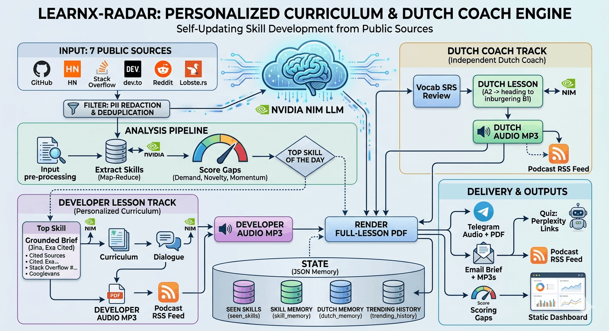

# LearnX-Radar

> **Daily AI-generated audio lessons from real developer trends — plus a Dutch coach for inburgering B1.**

[](https://yusuprozimemet.github.io/LearnX-Radar/)
[](https://open.spotify.com/show/033tPjkKDj5xF09FQC0Di7)
[](https://t.me/learnradar)
[](https://github.com/Yusuprozimemet/LearnX-Radar/stargazers)

LearnX-Radar is a self-updating curriculum engine that watches developer
signals for emerging skill gaps and auto-generates a personalized audio lesson.
Each lesson links to a Perplexity thread pre-loaded with the brief *text* for
follow-up Q&A (and a recall quiz), plus a static dashboard built from the
recorded state.

It also runs a second daily track — a **Dutch coach** — that rides the same
pipeline to teach Dutch (A2, heading toward inburgering B1) with the
**Delftse methode** (listen → imitate → produce): a small themed vocabulary
lesson, a spoken Dutch MP3 with built-in repeat pauses, an interactive trainer
page, and spaced repetition driven by **measured recall** — what you can
produce, not just what you were sent. See [Dutch coach](#dutch-coach).



## Subscribe (free)

- **Telegram — [t.me/learnradar](https://t.me/learnradar):** every daily lesson
       (developer + Dutch) as audio **plus the full lesson as a PDF**. Joining is the
       whole subscription — Telegram holds the member list, so **no personal data is
       stored** on my side.
- **Spotify — [listen on Spotify](https://open.spotify.com/show/033tPjkKDj5xF09FQC0Di7):** the daily lessons as a
       podcast show (or add the [feed URL](#podcast-feed) to any podcast app).
- **Waitlist for *personalized* lessons — [tally.so/r/WOqPdP](https://tally.so/r/WOqPdP):**
       early access to lessons matched to your stack & goals (individuals & teams). A
       reminder CTA is also posted to the channel weekly; we store only what you submit
       (see [Privacy](#data-and-privacy)).
- **Live dashboard — <https://yusuprozimemet.github.io/LearnX-Radar/>:** the
       public skill radar (trending skills, coverage map, lesson archive) with a
       🇳🇱 Dutch progress tab — rebuilt after every daily run, no login needed.
- **Dutch trainer — <https://yusuprozimemet.github.io/LearnX-Radar/dutch.html>:**
       today's Dutch lesson as an interactive Delft trainer — tap-to-play sentences,
       fill-in-the-blanks, the one-chance listening test, and one-tap saving of your
       scores back to the bot.

## What it does

- Collects signals from **seven** public sources: GitHub Trending, Hacker News
       (Who-is-Hiring + front page), Stack Overflow tag deltas, dev.to, Reddit, and
       Lobste.rs.
- Extracts skills via **map-reduce** over the corpus (chunked for recall, with
       **deterministic per-source attribution** — a corpus scan, not an LLM tally),
       scores gaps with spaced-repetition novelty **and a cross-day momentum signal**
       (rewards skills genuinely rising over time, damps one-day spikes), then selects
       a daily topic.
- Writes a teaching brief **grounded in the real source text** (read via Jina, plus
       fresh Exa web results when `EXA_API_KEY` is set) with cited `## Sources`; then
       plans a curriculum, generates dialogue, and builds one MP3 via edge-tts.
- Builds a second, independent **Dutch lesson** (vocab + sentences + dialogue +
       Dutch-voice MP3) from a curated word bank, with spaced-repetition review.
       The MP3 follows the **Delftse methode**: each sentence is followed by a
       repeat pause sized to say it back, then replays for self-checking; the
       lesson ends with a deterministic fill-in-the-blanks exercise.
- Publishes an **interactive Delft trainer page** on Pages
       ([live](https://yusuprozimemet.github.io/LearnX-Radar/dutch.html)):
       tap-to-play sentences with veiled translations, checked cloze, an enforced
       one-chance listening test — and a **"Save results" deep link** that sends
       your scores back to the bot, so failed words return sooner and recalled
       words space out further (no webhook, no token in the browser).
- Delivers both lessons to your Telegram DM **and an optional public broadcast
       channel** — audio + summary + the **full lesson as a PDF** (captions cap at
       1024 chars, so the PDF carries the complete, formatted lesson) — and to email
       (brief + MP3s).
- Posts a weekly **waitlist call-to-action** to the channel for upcoming
       personalized lessons (links a hosted form; no subscriber data stored here).
- **Cross-posts the lesson to dev.to** once a week (as a draft for review) for
       extra reach and SEO, with a footer linking back to the Telegram channel.
- Persists a knowledge memory and full briefs (whose text seeds each lesson's
       Perplexity follow-up Q&A and recall quiz).
- Redacts PII (emails, phone numbers, handles) from collected text at ingestion.
- **DMs the owner a failure report** when any pipeline stage fails (source fetch,
       audio, delivery, persistence) — the per-stage guards keep the run alive, and the
       report keeps those failures from hiding in Actions logs (`RUN_REPORT_ENABLED`).
- Builds a static dashboard from committed state, with a Radar / Dutch tab toggle.
- Publishes a **Spotify-compliant podcast RSS feed** (with cover art and
       iTunes directory tags) so the daily lessons land in Spotify or any
       podcast app.
- Generates a static dashboard with **Open Graph / Twitter share previews** and a
       "Join on Telegram" call-to-action so a shared link renders a rich card.

## Pipeline

```
scrape (7 sources) -> dedup -> extract skills (map-reduce + deterministic
                      attribution) -> score gaps (demand x novelty x momentum)
                      -> write grounded brief (Jina + Exa, cited)
                      -> plan curriculum -> generate dialogue -> build audio
                      -> ingest Dutch recall reports (getUpdates) -> build Dutch
                         lesson (vocab + sentences + Delft audio + trainer JSON)
                      -> render PDFs -> deliver (Telegram DM + channel, email)
                      -> persist state -> refresh dashboard + podcast feed
```

(On its configured weekday the run also posts the personalization-waitlist CTA to
the channel and cross-posts the lesson to dev.to as a draft.)

The Dutch branch is independent and fully guarded: any failure there is logged and
skipped so the developer lesson always ships. Set `DUTCH_ENABLED = False` in
[config.py](config.py) to turn the track off.


Privacy-relevant edges: the public channel and the waitlist store **no** personal
data on my side (see [Data and privacy](#data-and-privacy)); committed state JSON
holds only skill/dedup data, never source PII or subscribers.

## Accuracy & grounding

Three pieces sharpen *what* gets taught and *how grounded* the lesson is — each
behind a config flag for clean rollback:

- **Open-vocabulary discovery (7 sources).** Reddit, the HN front page, and
       Lobste.rs are open-vocabulary feeds, so the radar can surface skills it was
       never pre-configured to watch — not just a fixed tag/language list. Per-source
       weights (`SOURCE_WEIGHTS`) keep real demand (HN Hiring, Stack Overflow) above
       community buzz.
- **Map-reduce extraction + deterministic attribution** (`EXTRACTION_MAPREDUCE`).
       The corpus is chunked and skills extracted per chunk (recall), variants merged
       (`SKILL_ALIASES`), then each skill's source set is computed by **scanning the
       corpus** rather than trusting the LLM to tally — so the demand weight is exact.
       Chunk size was chosen by experiment ([scripts/exp_extraction.py](scripts/exp_extraction.py)).
- **Grounded briefs** (`GROUNDING_ENABLED`). Instead of writing from the skill name
       alone, the brief reads the actual sources that surfaced the skill (keyless Jina
       reader) plus fresh Exa web results, and cites a real `## Sources` list authored
       in code (the LLM never writes URLs). Read budget chosen by experiment
       ([scripts/exp_grounding.py](scripts/exp_grounding.py)). The grounding helpers in
       [radar/research/](radar/research/) are vendored from the sibling LearnX-Search.
- **Cross-day momentum** (`MOMENTUM_ENABLED`). Scoring looks back over
       `trending_history` (matched by canonical name) and boosts skills sustained and
       accelerating across days, while damping one-day spikes — orthogonal to the
       spaced-repetition novelty signal.

## Repository layout

```
agents/     source collectors (GitHub, HN hiring + front page, Stack Overflow,
            dev.to, Reddit, Lobste.rs)
radar/      map-reduce skill extraction, gap scoring (+ momentum), grounded
            brief writing, PII scrubbing
radar/research/  brief-grounding helpers vendored from LearnX-Search: Jina
            reader (keyless), Exa search (key-gated), relevance filter
learnx/     curriculum, dialogue, audio_builder, LLM client
dutch/      Dutch coach: curated wordlist, lesson builder, Delft audio layout,
            cloze exercises (cloze.py), trainer lesson JSON (trainer.py)
delivery/   Telegram (DM + channel) & email delivery, full-lesson PDF (pdf.py),
            Perplexity follow-up links, recall-report ingestion
            (telegram_recall.py), weekly waitlist CTA, weekly dev.to
            cross-post (devto_publisher.py)
dashboard/  static dashboard builder (Radar / Dutch tabs), the interactive
            Delft trainer page (dutch.html), podcast feed (feed.py),
            Open Graph preview + privacy.html
storage/    state files (seen_skills.json, skill_memory.json, last_scored.json,
            trending_history.json, dutch_memory.json, dutch_lesson.json)
briefs/     full lesson briefs (linked from lessons for Perplexity Q&A)
scripts/    one-off experiment harnesses (chunk size, grounding read budget,
            momentum window) — deletable, not part of the cron
specs/      per-day specs driving each slice (v1..v9)
output/     generated MP3 files and sample outputs
config.py   central configuration and model selection
main.py     daily pipeline entry point
```

## Stack

- LLM: NVIDIA NIM (OpenAI-compatible) using `meta/llama-3.3-70b-instruct`
       configured in [config.py](config.py).
- Grounding: keyless Jina Reader (`r.jina.ai`) for page reads + optional Exa
       neural web search (`EXA_API_KEY`) for fresh sources.
- TTS: edge-tts plus pydub (English co-host voices for dev lessons, `nl-NL` voices
       for Dutch lessons); ffmpeg required for audio assembly.
- PDF: full-lesson PDFs via `xhtml2pdf` (pure-Python; the CI/cron runners install
       `libcairo2-dev` + `pkg-config` for its build).
- Delivery: Telegram Bot API (your DM **+ a public broadcast channel**) and Gmail SMTP.
- Reach: weekly dev.to cross-post via the Forem API (`DEVTO_API_KEY`, draft by
       default), and a Spotify-compliant podcast feed served from GitHub Pages.
- Schedule: radar workflow runs at 06:00 UTC every day; dashboard + podcast feed
       deploy via GitHub Pages.

## Configuration

- Required env vars: `NVIDIA_API_KEY`, `TELEGRAM_BOT_TOKEN`, `TELEGRAM_CHAT_ID`,
       `GMAIL_APP_PASSWORD`, `EMAIL_FROM`, `EMAIL_TO`.
- Optional: `GITHUB_TOKEN` (higher GitHub API rate limits); `EXA_API_KEY` (free at
       exa.ai — enables Exa web results in brief grounding; without it grounding falls
       back to reading the day's own source URLs via Jina).
- Optional (public channel + waitlist): `TELEGRAM_CHANNEL_ID` (e.g. `@learnradar`),
       `TELEGRAM_CHANNEL_BOT_TOKEN` (a separate public bot that admins the channel, so
       DMs/quiz stay on the personal bot), and `WAITLIST_URL` (hosted form link). All
       degrade gracefully — unset means delivery goes to your DM only and the CTA is
       skipped.
- Optional (reach): `DEVTO_API_KEY` (dev.to → Settings → Extensions → API Keys)
       enables the weekly dev.to cross-post; unset means it's skipped. It posts a draft
       by default (`DEVTO_PUBLISHED = False`) on `DEVTO_POST_WEEKDAY` (Mon).
- The Dutch coach needs **no new secrets** — it reuses the same LLM and edge-tts.
       Tune it via the `DUTCH_*` constants in [config.py](config.py) (enable/disable,
       words per day, review cap, voices, Delft pauses/cloze/trainer toggles);
       `DUTCH_ENABLED = True` by default.
- Optional (recall feedback): `TELEGRAM_BOT_USERNAME` — the main bot's public
       @username (without the @), used by the trainer page's "Save results" deep
       link. Unset means the button simply isn't rendered; reports are accepted
       from `TELEGRAM_CHAT_ID` only (`DUTCH_RECALL_ENABLED`).
- Use [.env.example](.env.example) as the template.

## Dutch coach

A second daily track that teaches Dutch (A2, heading toward inburgering B1) using the
same engine and the **Delftse methode** (listen → imitate → produce). Each run it:

- Selects a small themed word set — themes **alternate** day to day (everyday Dutch
       vs. tech-flavoured Dutch tied to the day's developer topic).
- Makes one LLM call to wrap those **exact** words in A2 example sentences and a short
       dialogue, then renders a Dutch-voice MP3 via edge-tts — in **Delft blocks**:
       vocabulary and dialogue sentence-by-sentence with a repeat pause sized to say
       each line back (then a self-check replay), and the dialogue straight through.
- Ends the lesson with a deterministic **fill-in-the-blanks** exercise (gatentekst)
       over today's new words — no LLM, so nothing can be wrong.
- Publishes the lesson as JSON for the **interactive trainer page**
       ([dutch.html](https://yusuprozimemet.github.io/LearnX-Radar/dutch.html)): the
       four Delft listening steps with a real player, checked cloze, and a
       one-listen-per-sentence luistertoets.
- Closes the loop with **recall feedback**: the trainer's "Save results" button
       deep-links your scores to the bot as a `/start` message; the next morning's
       run reads them via `getUpdates` and reschedules — a failed word returns at the
       base interval, a recalled word spaces out further, an untrained word is
       untouched. The dashboard shows a rolling 30-day recall rate and the most-failed
       words.
- Mixes in words **due for spaced-repetition review** and tracks a streak + CEFR level
       in [storage/dutch_memory.json](storage/dutch_memory.json).
- Appends a 🇳🇱 section to the email, sends a separate Dutch message/audio to Telegram
       (with a "Train this lesson" button), and adds a "Quiz me in Dutch" Perplexity
       link covering *yesterday's* words.

**Correct by design:** vocabulary is anchored to a frozen, human-reviewed word bank
([dutch/wordlist.json](dutch/wordlist.json)). The LLM only writes sentences around fixed
words and never invents vocabulary — any generated word that isn't in the bank is
dropped, so a bad generation falls back to the verified gloss rather than a wrong word.
Grow the bank with the one-time generator (reviewed before committing):

```
python -m dutch.build_wordlist --theme everyday --cefr A2 --count 40
```

The roadmap (KNM, reading, grammar, adaptive pacing toward B1) lives in
[specs/v5](specs/v5) and [specs/v6](specs/v6); the Delftse-methode slice
(paused audio, cloze, trainer, recall feedback) in [specs/v9](specs/v9); see
[plan/plan.md](plan/plan.md).

## Local usage

```
pip install -r requirements.txt
# copy the example env file to .env and fill in values
python main.py
```

Other entry points:

```
python -m dashboard
```

In CI, the env values come from GitHub repo secrets (see
[.github/workflows/radar.yml](.github/workflows/radar.yml)).

## Workflows

- Radar run: [.github/workflows/radar.yml](.github/workflows/radar.yml) runs
       `python main.py` and commits updated state files and briefs.
- Pages: [.github/workflows/pages.yml](.github/workflows/pages.yml) runs
       `python -m dashboard` and publishes the static HTML.
- CI: [.github/workflows/ci.yml](.github/workflows/ci.yml) runs `ruff check .`
       and `pytest` on every push and pull request.

## State and outputs

- [storage/seen_skills.json](storage/seen_skills.json): dedup of source items
       already processed — a map of `id -> last-seen date`. A sighting expires
       after `SEEN_TTL_DAYS` (14) so trend sources (a repo still trending, a tag
       still hot) re-enter as fresh signal instead of being suppressed forever.
- [storage/skill_memory.json](storage/skill_memory.json): lesson history and
       spaced repetition data.
- [storage/dutch_memory.json](storage/dutch_memory.json): Dutch vocab
       spaced-repetition state — per-word due dates, recall counters, streak, CEFR
       level, a Dutch lesson archive, and the trainer recall-report log. Created on
       the first Dutch run and committed by the workflow.
- `storage/dutch_lesson.json`: today's full Dutch lesson (text + translations +
       cloze + audio seek map + recall-report contract) for the trainer page —
       overwritten each run, copied to Pages by the deploy.
- [storage/last_scored.json](storage/last_scored.json): latest scoring for the
       dashboard. Scored from the full scrape each run (not just post-dedup
       items), so the board always shows the complete demand picture and updates
       on every run.
- [storage/trending_history.json](storage/trending_history.json): one ranking per
       day (kept ~60 days). Powers the dashboard's date replay **and** the cross-day
       momentum signal (prior days are matched by canonical skill name).
- [briefs](briefs): full lesson briefs, linked from each lesson for Perplexity Q&A.
- [output](output): generated MP3 lessons — the developer lesson
       (`lesson-YYYYMMDD-<slug>.mp3`) and the Dutch lesson (`dutch-YYYYMMDD.mp3`).
- [dashboard/index.html](dashboard/index.html): generated static dashboard.
- [dashboard/dutch.html](dashboard/dutch.html): the static Delft trainer page
       (hand-written, not generated) — fetches `dutch_lesson.json` on Pages; progress
       lives in localStorage, results travel via the Telegram deep link (no backend).
- `dashboard/podcast.xml`: generated podcast feed (lesson MP3s hosted as assets on
       the `lessons` GitHub Release; built from committed state, published via Pages).

## Podcast feed

The daily MP3s (developer lesson + Dutch lesson) are uploaded as assets on a single
rolling GitHub Release (tag `lessons`) by the radar workflow, and `podcast.xml` is
published alongside the dashboard on GitHub Pages — Dutch episodes interleave with
the dev lessons by date. The feed is **Spotify compliant**: it
carries the required iTunes directory tags, an owner email for ownership
verification, and square cover art (`cover.png`), and episodes are de-duplicated by
audio GUID so a re-run never doubles an episode.

Listen on **[Spotify](https://open.spotify.com/show/033tPjkKDj5xF09FQC0Di7)**, or subscribe in any podcast app
(Pocket Casts, AntennaPod) by adding the feed URL:

```
https://yusuprozimemet.github.io/LearnX-Radar/podcast.xml
```

Audio is hosted on Releases (not committed to the repo and not on Pages) so it
never bloats git history or hits the Pages size cap — and it needs no credential
beyond the workflow's built-in `GITHUB_TOKEN`.

## Data and privacy

- All sources are public (GitHub Trending, HN "Who is Hiring?" + front page,
       Stack Overflow tag counts, dev.to RSS, Reddit `.rss`, Lobste.rs RSS). No
       accounts or private data are scraped.
- Brief grounding fetches public pages via Jina Reader and (optionally) Exa
       search; fetched page text is PII-scrubbed before it reaches the LLM,
       persistence, or delivery — treat Jina and Exa as third parties.
- PII (emails, phone numbers, @handles) is redacted from collected text at
       ingestion in [radar/privacy.py](radar/privacy.py) — before dedup, before
       the LLM, and before anything is persisted, delivered, or linked to
       Perplexity. Only `hn:<id>`-style keys (no source text) are persisted to
       [storage/seen_skills.json](storage/seen_skills.json).
- Text is processed by the NVIDIA NIM LLM, and each lesson links out to
       Perplexity — treat both as third parties.
- Dedup state expires after 14 days and is capped (5000 entries) so it does not
       grow without bound.
- **Dutch trainer:** progress stays in your browser's localStorage; recall
       reports travel as a `/start` message **from your own Telegram account to your
       own bot** (the page only builds a URL — no token in the browser, no backend).
       The pipeline accepts reports from the owner chat only.
- **Subscribers & waitlist:** the Telegram channel stores **no** personal data on
       my side (Telegram manages membership). The early-access waitlist is a hosted
       form (Tally) that stores only the email you submit (+ optional segment/goals),
       under consent; see the [privacy policy](https://yusuprozimemet.github.io/LearnX-Radar/privacy.html).
       No subscriber list is ever committed to this repo.

## Tests

```
pytest
ruff check .
```
