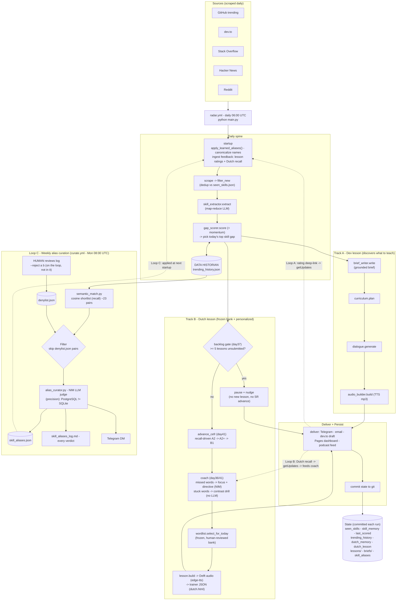
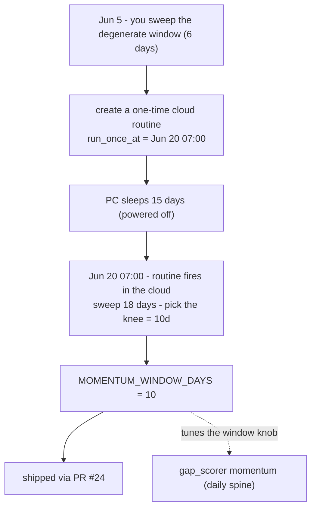
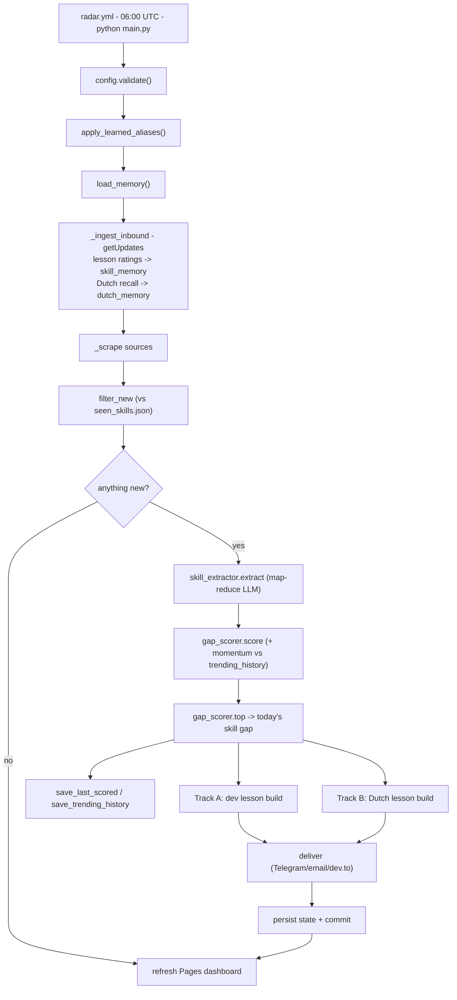
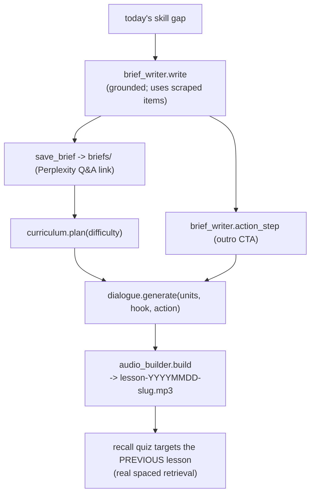
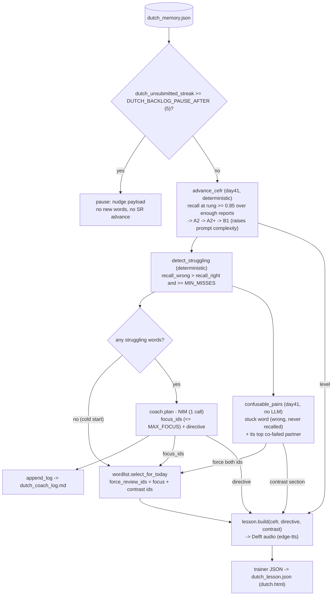
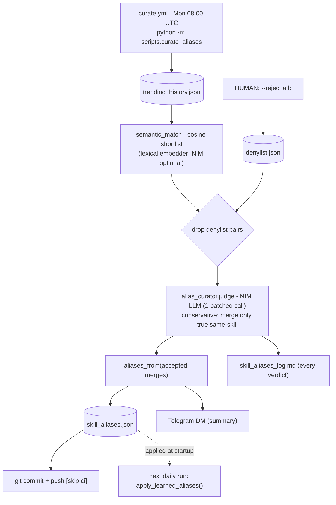
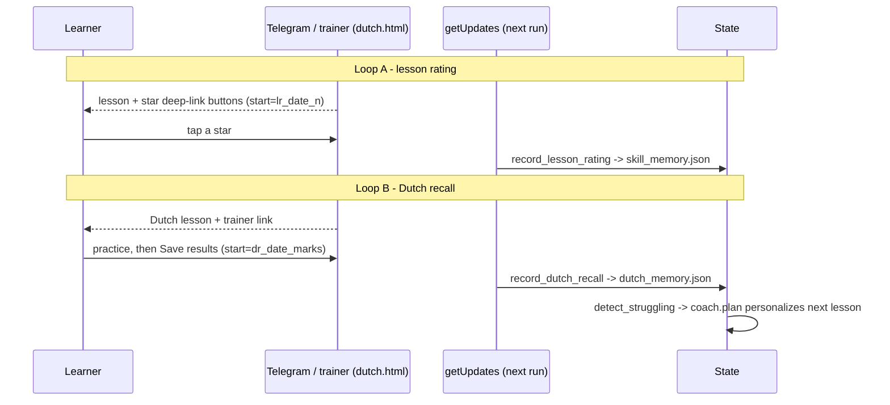

# LearnX-Radar — system diagrams

Mermaid diagrams of the whole system and each vertical. Grounded in `main.py`
(daily spine), `scripts/curate_aliases.py` + `.github/workflows/curate.yml` (weekly
curation), and the `dutch/` track. Render on GitHub, or in any Mermaid viewer.

Two scheduled entry points:

- **`radar.yml`** — daily 06:00 UTC, runs `python main.py` (the spine + both lesson tracks).
- **`curate.yml`** — Mondays 08:00 UTC, runs `python -m scripts.curate_aliases` (Loop C).

Three feedback loops: **A** lesson ratings, **B** Dutch recall, **C** alias curation.

---

## 1. Full system

---

## 2. Setup — one-time momentum-window tune (historical, not a feedback loop)

How `MOMENTUM_WINDOW_DAYS = 10` was chosen, once, in the cloud.

---

## 3. Daily spine (`main.py._run`)

The exact order the daily run executes.

---

## 4. Track A — Dev lesson (discovers what to teach)

---

## 5. Track B — Dutch lesson (frozen bank + personalized)

Includes the day37 backlog gate, the day36 coach, and the day41 recall-driven
progression + contrast drill. Vocabulary is never invented — the LLM only
selects/emphasizes within the frozen `dutch/wordlist.json`.

---

## 6. Loop C — Weekly alias curation (`curate.yml`)

Embeddings propose, the NIM LLM decides, accepted merges commit themselves back so
the next daily run collapses the variants. Human stays on the loop (audit + revert),
not in it (no approval blocks the daily lesson).

---

## 7. Feedback loops A & B (deep-link, no server)

Both reuse the same trick: a delivered Telegram deep-link the learner taps; the next
morning's run reads it via `getUpdates` and folds it into state. Loop B's recall data
is exactly what the Dutch coach personalizes from.

