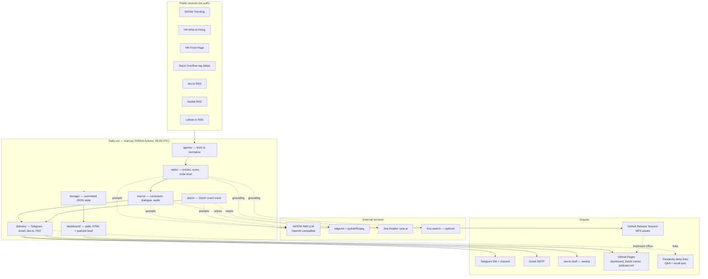
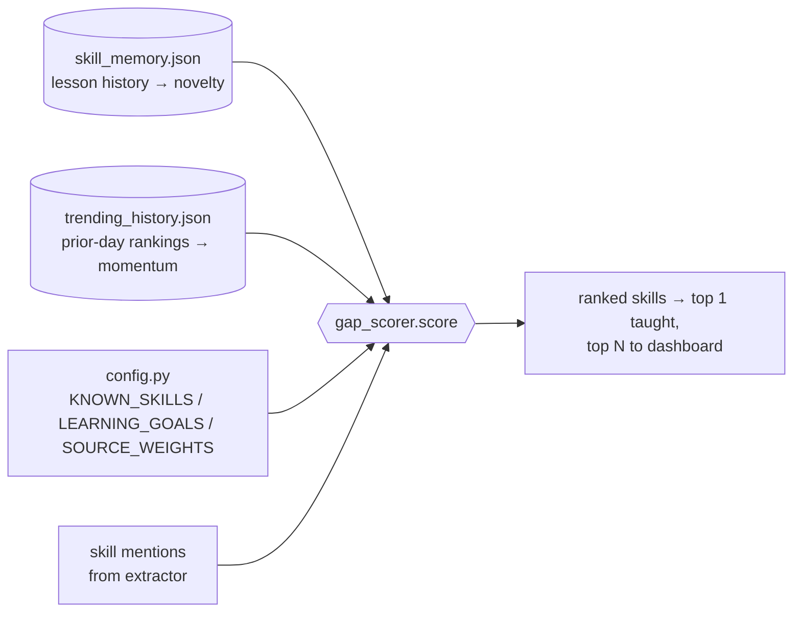
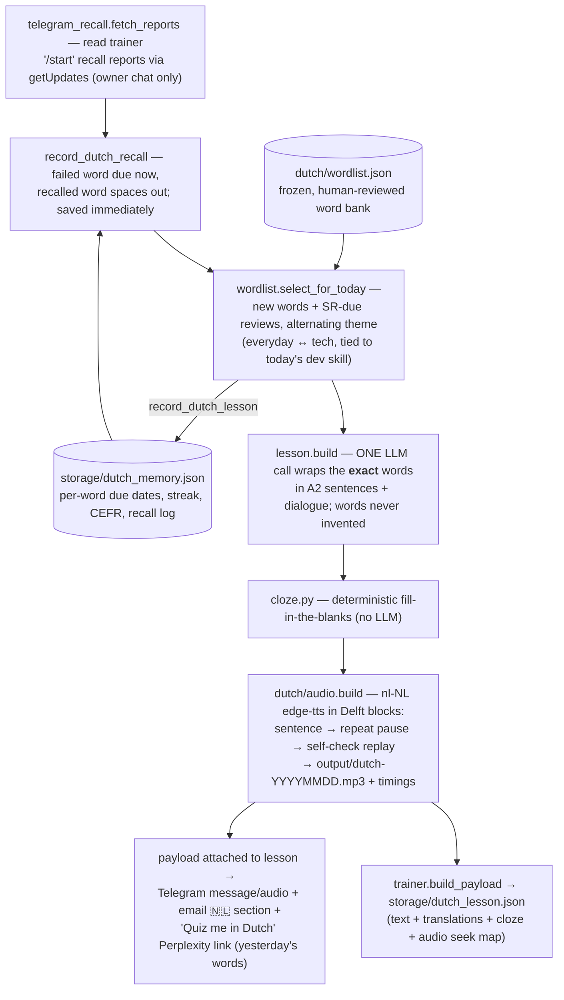
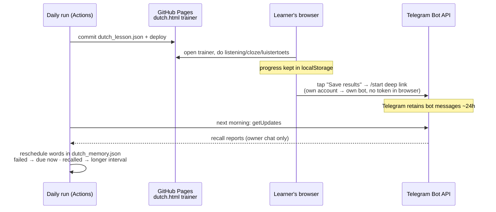
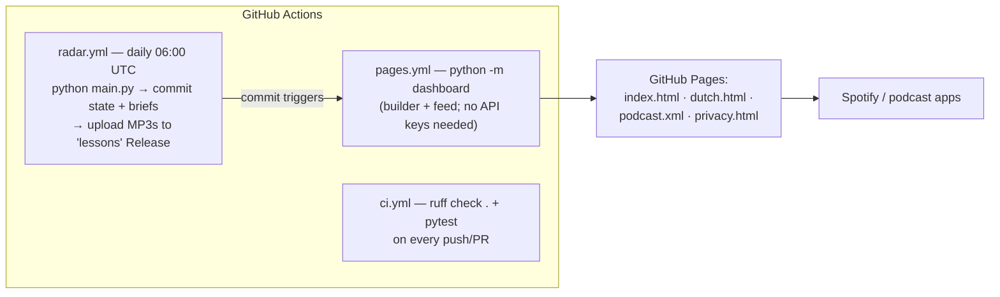

# LearnX-Radar — Architecture & Data Flow

LearnX-Radar is a **cron-driven, stateless-server** pipeline: a single daily run
([main.py](main.py)) scrapes public developer signals, picks one skill gap, generates an
audio lesson (plus an independent Dutch lesson), delivers everything, and persists all
state as **committed JSON files** — no database, no backend. GitHub Actions is the
runtime; GitHub Pages is the frontend; Telegram `getUpdates` is the only inbound channel.

## 1. High-level architecture

## 2. Daily pipeline data flow

The orchestration in [main.py](main.py) — every stage is guarded so one failure
degrades instead of killing the run; failures are collected and DM'd to the owner
at the end (`_report`).

```mermaid
flowchart TD
    START([cron 06:00 UTC]) --> VAL[config.validate + load_memory]
    VAL --> CTA[Weekly waitlist CTA to channel<br/><i>only on its weekday</i>]
    CTA --> SCRAPE

    subgraph Ingest["1 · Ingest"]
        SCRAPE["_scrape: 7 agents fetch()<br/>normalized items {id, source, title, url, text, meta}"]
        SCRUB[privacy.scrub — redact emails/phones/handles<br/><b>before</b> dedup, LLM, persistence, delivery]
        DEDUP["filter_new vs seen_skills.json<br/>(14-day TTL)"]
        SCRAPE --> SCRUB --> DEDUP
    end

    DEDUP -->|nothing new| QUIET[refresh dashboard, done]
    DEDUP --> EXTRACT

    subgraph Radar["2 · Radar (pick what to teach)"]
        EXTRACT["skill_extractor.extract — map-reduce LLM:<br/>chunk corpus → extract per chunk → merge aliases →<br/>deterministic per-source attribution (corpus scan)"]
        SCORE["gap_scorer.score — pure, no LLM:<br/>demand × novelty × table-stakes × known × goal × momentum"]
        TOP["top() → today's skill<br/>save_last_scored + save_trending_history"]
        EXTRACT --> SCORE --> TOP
    end

    TOP -->|no teachable gap| QUIET2[refresh dashboard, done]
    TOP --> BRIEF

    subgraph Learnx["3 · Lesson generation"]
        BRIEF["brief_writer.write — grounded brief:<br/>reads real source pages via Jina (+ Exa results),<br/>cited ## Sources authored in code, not by the LLM"]
        CUR["curriculum.plan — teaching units sized to duration"]
        DIA["dialogue.generate — ALEX/MAYA two-host script<br/>(concurrent per unit)"]
        AUD["audio_builder.build — edge-tts render →<br/>output/lesson-YYYYMMDD-slug.mp3"]
        BRIEF --> CUR --> DIA --> AUD
    end

    BRIEF -- save_brief --> BRIEFS[(briefs/*.md<br/>committed; seeds Perplexity Q&A)]
    AUD --> QUIZ["attach recall quiz: <i>previous</i> lesson's<br/>brief text → Perplexity deep link"]
    QUIZ --> DUTCH["3c · Dutch track (see §3)<br/>isolated — never blocks the dev lesson"]
    DUTCH --> SEND

    subgraph Deliver["4 · Deliver (channels independent)"]
        SEND["telegram_sender.send — MP3 + caption +<br/>full-lesson PDF (pdf.py) to DM + channel"]
        MAIL["email_sender.send — brief as HTML + MP3s"]
        DEVP["devto_publisher — weekly draft cross-post"]
        SEND --> MAIL --> DEVP
    end

    DEVP --> PERSIST

    subgraph Persist["5 · Persist (only after lesson produced)"]
        PERSIST["mark_seen → seen_skills.json<br/>record_lesson → skill_memory.json<br/>record_dutch_lesson → dutch_memory.json"]
    end

    PERSIST --> DASH["6 · dashboard.build — regenerate index.html<br/>from memory + today's ranking"]
    DASH --> REPORT["_report: DM collected stage failures to owner"]
    REPORT --> DONE([done])
```

### Scoring inputs (what feeds `gap_scorer`)

## 3. Dutch coach track (Delftse methode)

An independent second track built in the same run (`_build_dutch` in
[main.py](main.py)) — any failure returns `(None, None)` so the developer lesson
always ships.

### Recall feedback loop (no backend, no webhook)

## 4. State files (the "database")

All state lives in committed JSON — the Actions workflow commits it back after each
run, so state survives without external storage.

| File | Written by | Read by | Purpose |
|---|---|---|---|
| [storage/seen_skills.json](storage/seen_skills.json) | run (mark_seen) | run (filter_new) | dedup, 14-day TTL, capped 5000 |
| [storage/skill_memory.json](storage/skill_memory.json) | run (record_lesson) | scorer (novelty), quiz, dashboard | lesson history + SR data |
| [storage/last_scored.json](storage/last_scored.json) | run (save_last_scored) | dashboard | latest ranking (rebuildable without API keys) |
| [storage/trending_history.json](storage/trending_history.json) | run | scorer (momentum), dashboard date replay | one ranking per day, ~60 days |
| [storage/dutch_memory.json](storage/dutch_memory.json) | run (record_dutch_lesson / _recall) | Dutch selection, dashboard | per-word SR state, streak, CEFR, recall log |
| `storage/dutch_lesson.json` | run (trainer.build_payload) | dutch.html on Pages | today's trainer lesson, overwritten daily |
| [briefs/](briefs/) | run (save_brief) | Perplexity links, next-day quiz | full lesson briefs |
| [output/](output/) | audio builders | release upload | MP3s (hosted on the `lessons` Release, not Pages) |

## 5. Workflows & deployment

Key design point: the Pages workflow has **no secrets** — the dashboard and podcast
feed rebuild purely from committed state (`last_scored.json`, `skill_memory.json`,
`trending_history.json`, `dutch_memory.json`), which is why the run persists its
ranking instead of letting the dashboard re-run the radar.

## 6. Privacy edges

- PII (emails, phones, @handles) is scrubbed in [radar/privacy.py](radar/privacy.py)
  **at ingestion** — before dedup, the LLM, persistence, delivery, or Perplexity links.
- Committed state holds only skill/dedup keys (`hn:<id>`), never source text or subscribers.
- Third parties that see text: NVIDIA NIM (LLM), Jina/Exa (grounding), Perplexity (links).
- The Dutch trainer has no backend: progress is localStorage; recall reports travel as a
  Telegram deep link from the learner's own account; the pipeline accepts reports from
  the owner chat only.
