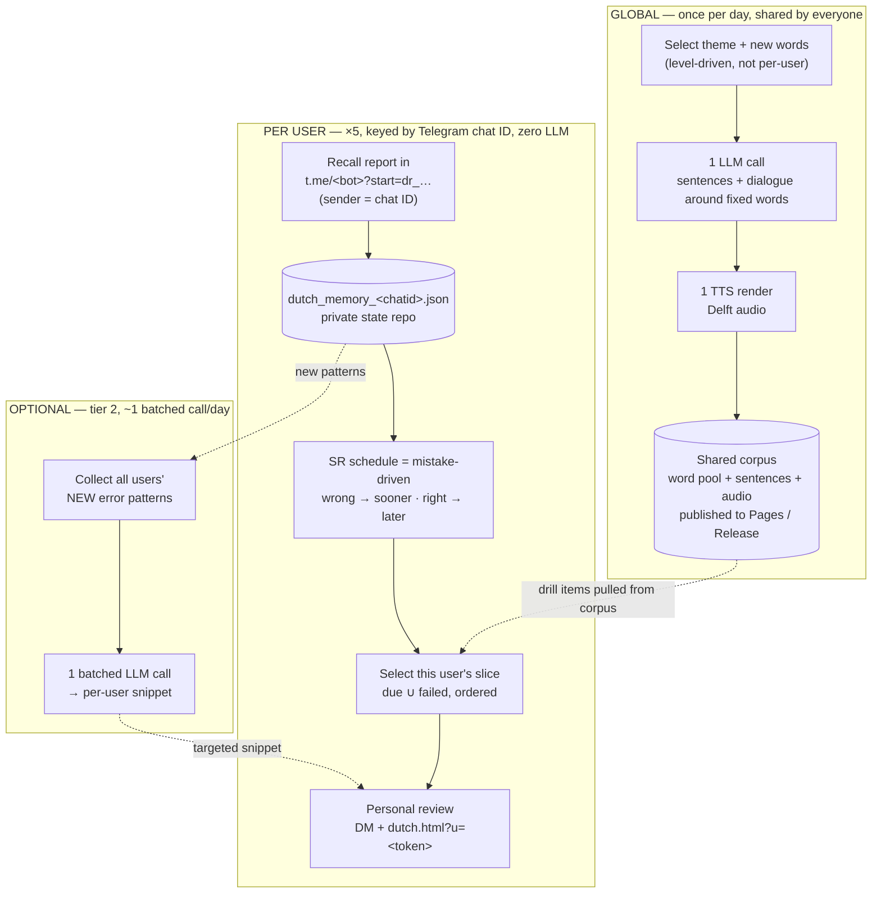
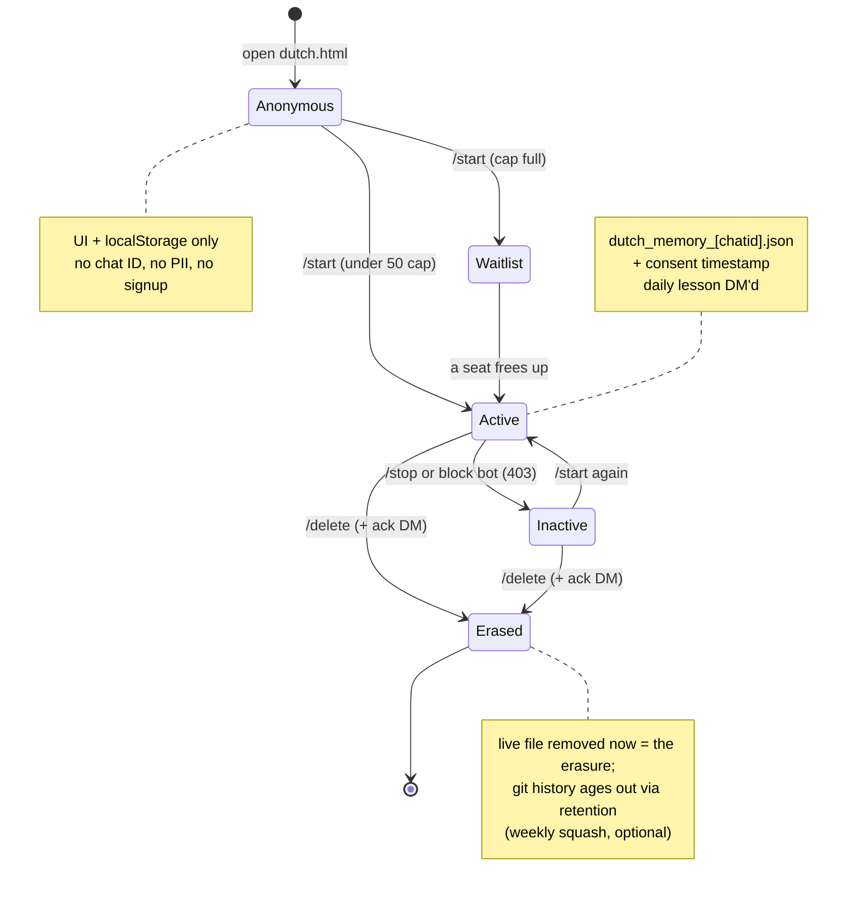

# LearnX-Radar — Personalization & multi-user plan

> Status: **Phase 1 IMPLEMENTED** (behind the `ALLOWED_CHAT_IDS` flag — empty means
> single-user, unchanged); Phase 1.5 + Phase 2 still planned. Scope: let ~5 known
> people use the Dutch track with
> their own progress, mistakes, and review — without per-user LLM/TTS cost and
> without accounts, auth, or a backend. Supersedes the framing in
> [../ideas/dutch-personalization-multiuser.md](../ideas/dutch-personalization-multiuser.md)
> now that personal state lives in a **private** repo (the old plan's main
> objection — chat IDs as PII in a public repo — is gone).
>
> **Two phases, don't conflate them.** **Phase 1** (the shippable ~20–40 lines):
> per-user personalization for **5 known people behind a static allowlist** — no
> enrollment, no lifecycle, no GDPR apparatus. **Phase 2** (written below but
> *not the next thing to build*): self-serve subscribe/unsubscribe/delete for up
> to 50 strangers. Phase 2 solves problems Phase 1 doesn't have; keep it on the
> shelf until real demand forces it (the repo's standing rule).

---

## The core distinction: generation vs. selection

"Personalized lesson" conflates two things with very different costs:

- **Generation** — writing the sentences/dialogue, making the audio. Expensive
  (LLM + TTS). Done **once, globally**, shared by everyone.
- **Selection** — *which* slice of the generated corpus each user drills today,
  and in what order. Cheap (a per-user query over shared data). **This is what
  we personalize.**

So personalization here = a **per-user queue and schedule over one shared
corpus**, not per-user content generation. Same economics as any SRS (Anki, etc.):
a fixed card set, a personal schedule on top.

## Flow

One **global** generation path (left, runs once/day, shared by all) feeds a
shared corpus; each user gets a **personal** selection path (right, per chat ID)
on top of it. The only cross-user cost is the optional batched call.

Read it as: everything in **GLOBAL** happens once and costs the same no matter
how many users there are; everything in **PER USER** is a cheap query over that
output, driven by each person's own recorded mistakes; **TIER2** is the only
place new content is generated for individuals, and it's one shared call.

## Spaced repetition is already the mistake-driven engine

Mistake-driven is **not** a second system competing with SR — a mistake is the
*input* that drives the SR schedule. Already implemented in
[`record_dutch_recall`](../storage/state.py) (`storage/state.py`):

- mark `1` (recalled) → interval widens, word backs off.
- mark `0` (**failed**) → `reps` reset to 1, `due` pulled to lesson date + base
  interval → **the word returns sooner**.
- mark `x` (not trained) → untouched.

So a wrong answer already reschedules that item to the front. Make the memory
file per-user and you have per-user mistake-driven review for free.

## Cost tiers (what's free, what's cheap, what to avoid)

1. **Free — no LLM.** Per-user selection/scheduling + deterministic drills over
   the shared pool. Covers the dominant case: "forgot a word that was already
   taught." Re-teaching a known-but-failed word reuses its existing sentence +
   audio; the cloze in [`dutch/cloze.py`](../dutch/cloze.py) needs no LLM. **Five
   users can get five fully divergent review sets today, at zero LLM cost.**
2. **~1 call/day — batched.** Genuinely new error patterns not covered by the
   pool (e.g. "user A keeps confusing de/het") need novel content. Fold **all 5
   users' error patterns into one prompt** that emits a per-user snippet — one
   call for the whole group, not N. Cost ~flat in user count until the prompt
   gets large.
3. **N calls — avoid.** Fully independent per-user lessons. Not needed at this
   scale.

The instinct "we can't personalize because of LLM calls" only applies to tier 3.
Tier 1 gives most of the value free; tier 2 recovers true mistake-driven
*generation* without per-user cost.

## The real limit: curriculum divergence, not different mistakes

Different *mistakes over the same curriculum* is the easy, mostly-free case.
The actual wall is different *curricula*: if the 5 users are at different levels
or chasing different goals, a shared corpus simply doesn't contain what user B
needs — no selection can conjure ungenerated content. The fix when that day
comes: widen the **global** generation to a superset pool (still one bigger
shared call) so every user's queue has something to pull. Until then, keep new
words global/level-driven.

---

## Multi-user mechanics (why this is a small delta)

The recall loop is **already multi-user by construction**:

- The trainer page builds `t.me/<bot>?start=dr_<YYMMDD>_<marks>`. When any of the
  5 people taps it, *their own* Telegram account sends the `/start`, so the
  inbound message already carries *their* chat ID. Telegram identifies the user
  for free — no accounts, no login.
- The daily run reads one `getUpdates` batch and routes payloads in
  [`delivery/telegram_recall.py`](../delivery/telegram_recall.py). It already
  parses multiple payload *kinds* from one batch; routing by *sender* is the same
  shape.

Only two things make it single-user today:

1. The `chat_id == TELEGRAM_CHAT_ID` guard that drops non-owner reports.
2. A single `dutch_memory.json` instead of one per person.

Flip those and you have 5 users.

## Phase 1 — ship this (5 known people, static allowlist)

The whole of Phase 1 is steps 1–4 below against a **hardcoded allowlist of five
chat IDs**. Critically, this needs **none** of the `getUpdates` lifecycle
(`/start`/`/stop`/`/delete`), no enrollment, no consent records, no squash — the
five IDs are added by hand, so there are no inbound control messages to lose and
no self-serve erasure to guarantee. That keeps the cron-reliability and
GDPR-erasure problems (see Phase 2) entirely out of the shippable change.

### 1. Allowlist instead of single owner
- New env var `ALLOWED_CHAT_IDS` (comma-separated, the five known IDs). The owner
  ID stays in the set. It's a **static** list edited by hand — not populated by
  enrollment.
- In [`delivery/telegram_recall.py`](../delivery/telegram_recall.py), accept
  `dr_`/`lr_` reports from any chat ID in the allowlist; still drop everyone
  else. Tag each parsed report with its sender chat ID.

### 2. Per-user state files (private repo is the DB)
- Per-user `dutch_memory_<chatid>.json` (and `skill_memory_<chatid>.json` if the
  dev track follows) in the **private** state repo, under `STATE_DIR`.
- Parametrize the path in [`storage/state.py`](../storage/state.py):
  `load_dutch_memory(chat_id)` / `save_dutch_memory(memory, chat_id)` — the SR
  functions already take a memory dict, so only the file path changes (~20 lines).
- Fold each user's recall into *their* file; compute *their* due set from it.

### 3. Delivery loop
- One LLM call, one TTS, one lesson per day — **unchanged cost**. New words stay
  global/level-driven.
- DM the lesson to each chat ID in a loop. The public channel post stays single.

### 4. UI — personal review section

**Decide the source of truth up front, or the two stores drift.** A user who
drills on the page (localStorage) *and* gets Telegram-driven scheduling otherwise
ends up with two diverging copies of "what's due," and you'll be debugging why
phone ≠ laptop. So:

> **The published `review/<token>.json` (server-side) is canonical.**
> `localStorage` is a **cache** that reconciles to it on load (server state wins
> on conflict); offline drills queue locally and fold in via the next recall
> report.

Two levels; pick per "persist across devices?":
- **(a) Less work — client-side only.** Compute due words in `dutch.html` from the
  visitor's `localStorage` results (the parked plan). Persists per-device only;
  dies with cleared browser data. Use this *only* for fully anonymous visitors who
  never link Telegram — there's no server copy to drift from.
- **(b) Cross-device persistent (recommended for linked users).** The run
  publishes a per-user due-list to Pages, fetched via an unguessable token in the
  URL (`dutch.html?u=<token>` → `review/<token>.json`); the token maps to a chat ID
  server-side. ~one extra write-out step in the run.
  - **Honest security note:** this is *public-with-a-password*. The data isn't
    exposed *by chat ID*, but the token leaks via browser history, shared links,
    and `Referer` headers to any third-party asset the page loads — so treat
    `review/<token>.json` as effectively readable by anyone who sees the URL.
    Acceptable because the contents are low-stakes (which Dutch words are due), not
    because they're truly private.

## Phase 1.5 — mistake-driven generation (optional, after Phase 1 proves out)

> **Not part of the shippable Phase 1 core (steps 1–4).** Phase 1 is selection
> only — zero LLM. This step reintroduces an LLM call (the tier-2 batched one) and
> needs error-pattern detection that selection doesn't, so it's a separate, later,
> optional addition. Add it once per-user *selection* is actually landing.

- Once per day, collect the allowlist users' recent failed-word / error patterns,
  send **one batched prompt**, and attach each user's targeted snippet to their
  DM and their `review/<token>.json`. Skip entirely when nobody has a new pattern.
- Precondition it doesn't have yet: a way to detect a *new* error pattern worth
  generating for (beyond "this known word is due"), since that's the input the
  batched prompt needs.

## Phase 2 — self-serve lifecycle & GDPR (up to 50 users) — NOT the next build

> Everything below is **deferred**. It's written down so the thinking isn't lost,
> but it solves problems 5 known people don't have. Build it only when there's
> real demand for self-serve enrollment — and read the two hard preconditions
> first (`getUpdates` reliability for `/delete`, and the erasure framing), because
> they're what make this genuinely harder than Phase 1, not the line count.

Subscribe / unsubscribe / delete is by nature a **stateful, real-time,
identity-bearing** feature set, while this app is deliberately **stateless,
once-a-day batch, identity-free**. Crossing that line is fine at ≤50 users, but
it's the project's first real account-lifecycle responsibility. The design below
crosses it as cheaply as possible by keeping **identity = Telegram chat ID
only** — so we store essentially no PII and most of GDPR delegates to Telegram
(the identity controller).

### Lifecycle at a glance

Anyone can use the trainer anonymously (UI + `localStorage`, no Telegram). The
states below only apply once a user opts into Telegram for sync / daily push.
**Every transition is applied by the next daily cron (~24h), not instantly** —
that's the accepted trade for staying server-free.

All inbound signals (`/start`, `/stop`, `/delete`, block→403) are read from the
same once-a-day `getUpdates` batch the recall loop already consumes — no new
channel, just new payload kinds.

### Identity & consent
- A user is just a Telegram chat ID. No email, no username, no password (see
  "Email" below for why email is deferred). The only personal datum we hold is
  the chat ID plus their SR progress in `dutch_memory_<chatid>.json`.
- On enrollment, store a **consent timestamp** in the user's record. The bot link
  / landing copy states what's stored and links the
  [privacy policy](../dashboard/privacy.html) — that's the consent record.

### Subscribe (auto-enroll, capped at 50)
- `/start` from an unknown chat → the next daily run sees it via `getUpdates` →
  if the active-user count is `< 50`, create the per-user memory file + consent
  timestamp; otherwise reply "waitlist full for now."
- **No live acknowledgement** — there's no always-on process, so enrollment takes
  effect on the next cron (up to ~24h). We accept this rather than add a webhook;
  the bot link's landing copy sets the expectation:

  > **You're in — your first lesson arrives tomorrow morning.**

  Cheapest path, slightly clunky, fine at this scale. (If instant ack ever
  matters, a tiny serverless webhook that only sends the "you're in" reply is the
  upgrade — explicitly out of scope now.)

### Unsubscribe
- `/stop` parsed from the same `getUpdates` batch → flag the user inactive, stop
  DMing. Latency is harmless here (stopping a day late hurts nothing).
- Or the user simply **blocks the bot** → delivery returns `403` → auto-deactivate
  on the spot. Telegram's native "leave" gesture is the unsubscribe for free.

### Delete (GDPR right to erasure)

Two things make this the hardest part of Phase 2 — neither is the line count.

**(a) The signal can be silently dropped — fix before advertising self-serve
erasure.** `/delete` rides the once-a-day `getUpdates` batch, and that batch is
fragile in exactly the wrong way: Telegram clears updates ~24h after the offset is
advanced, *and* GitHub scheduled workflows are themselves unreliable (routinely
delayed, occasionally skipped). So one missed cron run can expire a `/delete`
before any run consumes it — the user believes they erased themselves and you have
no record the request ever arrived. The framing "every transition applies at next
cron" quietly assumes a cron that doesn't drop runs; for erasure that assumption
is load-bearing. Minimal **server-free** mitigations (no webhook):
- The run **DMs a completion ack** after erasing ("your data has been deleted") so
  a dropped signal is *detectable* — no ack within ~48h means re-send.
- A documented **manual erasure backstop** (email the owner). At 5–50 users,
  deleting a file by hand is trivial and is the real guarantee behind the
  self-serve path.

**(b) Erasure framing — removing the live file is the response; history ages
out.** The cleanest legal stance is: deleting `dutch_memory_<chatid>.json` + the
enrollment entry **is** the erasure response; git history is backend backup that
expires under a retention policy. A scheduled **state-repo squash** workflow is
then *optional retention hygiene*, not the load-bearing legal mechanism — but if
you do lean on squash to back the erasure claim, run it **weekly**, not monthly
(a `/delete` right after a monthly squash leaves ~30 days to purge-from-history,
which brushes GDPR's one-month edge rather than sitting well inside it).
- **Squash is not free:** it throws away the ability to roll back a corrupted SR
  file or debug why a schedule went weird — you're trading recoverability of your
  most stateful data for history hygiene. Weigh that before adopting it; see the
  parked `ideas/state-retention-rotation.md`.
- (Not a lawyer; if you genuinely need defensible erasure-from-history, isolating
  PII into a store you *can* rewrite is the alternative to squashing the whole
  state repo.)

### Email — deferred (deliberately)
Not a cost problem (Gmail SMTP already does ~500/day; 50 is nothing). It's the
expensive choice in **liability and plumbing**, so it's left out for now:
- **Stored PII.** Chat IDs are borderline; **emails are unambiguously PII.** Today
  we store almost nothing because Telegram holds identity. Adding emails makes us a
  real data controller — consent records, secure storage, and a heavier erasure
  burden.
- **Unsubscribe needs an endpoint.** Law + Gmail/Apple require working one-click
  unsubscribe in every email; with no server the realistic hack is a Telegram
  deep-link unsubscribe (which ties email lifecycle back to Telegram anyway).
- **Deliverability.** Bulk daily mail from a personal Gmail to strangers → spam
  flags and possible account suspension; doing it properly means an ESP
  (Resend/Postmark/SES) — another dependency.

If email is ever added, it's an **explicit, separately-consented opt-in** sent via
an ESP, never on by default.

## Explicitly NOT building (until real demand forces it)
- Accounts, passwords, OAuth, webhooks, a database, a server.
- Per-user lesson text or audio (tier 3).
- Independent per-user **new-word** pacing — only when users' levels genuinely
  diverge; then widen the shared pool first (see "The real limit" above).

## Open decision (read before implementing)
**Do the 5 share the global new-word pace, or need independent new-word
selection?** Recommend shipping **shared new words + per-user review/mistake
scheduling/storage** first (steps 1–4), and adding independent pacing only if
their CEFR levels actually diverge.